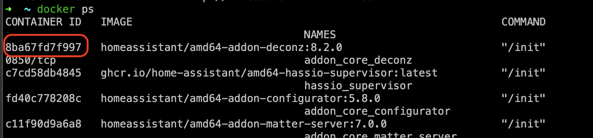
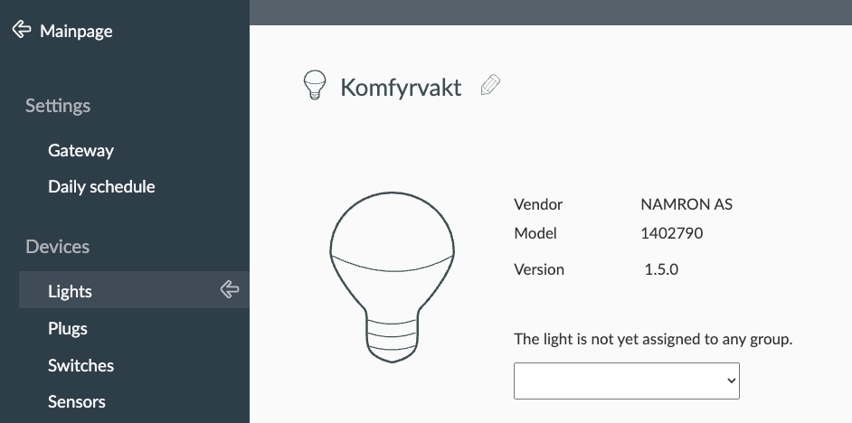
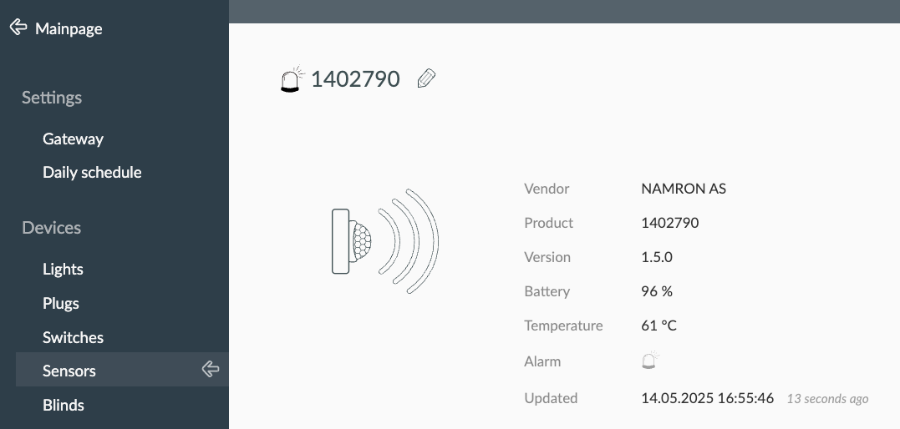
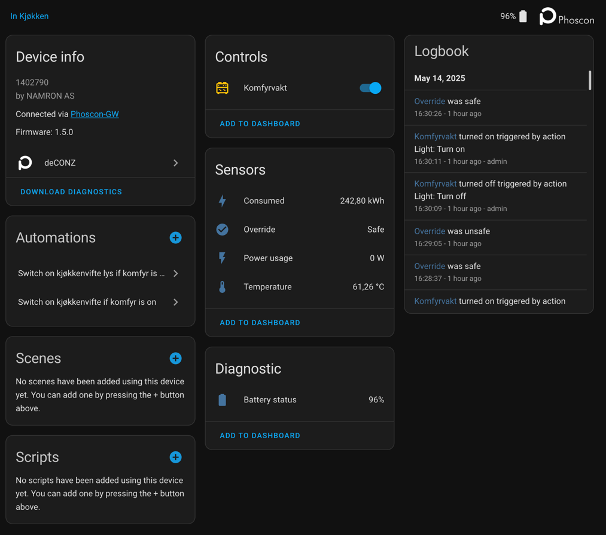

deCONZ DDF file for [Namron Zigbee Komfyrvakt](https://www.elektroimportoren.no/namron-zigbee-komfyrvakt/namron-komfyrvakt-zigbee/Document.html).

`TL;DR` you need to copy `power_control_unit.json` file to the
`/data/.local/share/deCONZ/devices/` folder of deCONZ container, then restart deCONZ add-on.

You can use [Advanced SSH & Web Terminal](https://github.com/hassio-addons/addon-ssh)
Home Assistant add-on with disabled Protection mode.

1. Log into Home Assistant via ssh.

2. Run `docker ps` and find the `CONTAINER ID` of deCONZ add-on.



3. Run `docker exec -it CONTAINER_ID bash` to access the container.

4. Change folder
```bash
  cd /data/.local/share/deCONZ/devices/`
```
5. Download DDF file or copy/past content of the DDF file.

```bash
  wget https://raw.githubusercontent.com/kuzmin-no/Namron_Komfyrvakt_DDF_file_for_deCONZ/main/power_control_unit.json
```

6. Restart deCONZ add-on.

7. Pair the Namron Stove Guard in Phoscon-GW and will see one On/Off switch in Lights



and one Sensor



8. Reload deCONZ integration in Home Assistant and you will see the new device.


